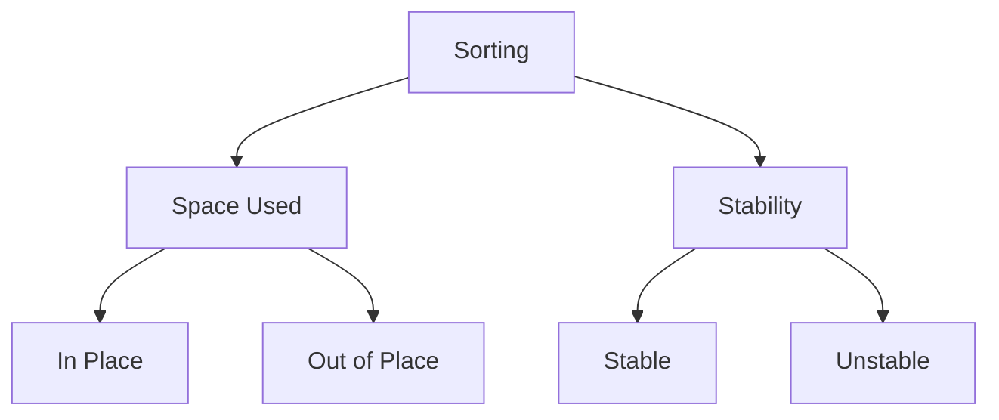

# Sorting

Types of Sorting Algorithm

### Space Used

**In Place Sorting :** Sorting algorithm which does
not require any extra space for sorting.

**Example :** Bubble Sort

| 70 | 10 | 80 | 30 | 20 | 40 | 60 | 50 | 90 |
|----|----|----|----|----|----|----|----|----|

| 10 | 20 | 30 | 40 | 50 | 60 | 70 | 80 | 90 |
|----|----|----|----|----|----|----|----|----|

**Out Place Sorting :** Sorting algorithm which requires
extra space for sorting.

**Example :** Merge Sort

### Stability

**Stable Sorting :** If sorting algorithm after sorting
the contents does change the sequence of the similar
content in which they appear, then this sorting is called
stable sorting.

**Example :** Insertion sort

| 70 | 10 | 80 | 40(G) | 20 | 40(R) | 60 | 50 | 90 |
|----|----|----|-------|----|-------|----|----|----|

| 10 | 20 | 40(G) | 40(R) | 50 | 60 | 70 | 80 | 90 |
|----|----|-------|-------|----|----|----|----|----|

**Unstable Sorting :** If sorting algorithm after sorting
the contents changes the sequence of the similar
content in which they appear, then this sorting is called
unstable sorting.

**Example :** Quick Sort

## Sorting Algorithms

|  Algorithm  | Time Complexity  | Space Complexity | Stability |
|:-----------:|:----------------:|:----------------:|:---------:|
| Bubble Sort | O(N2) |       O(1)       |           |